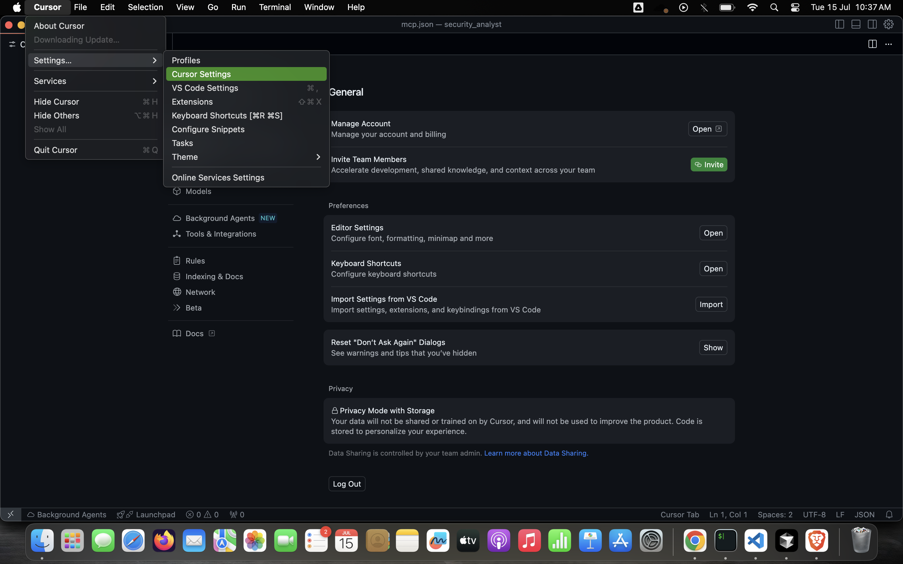
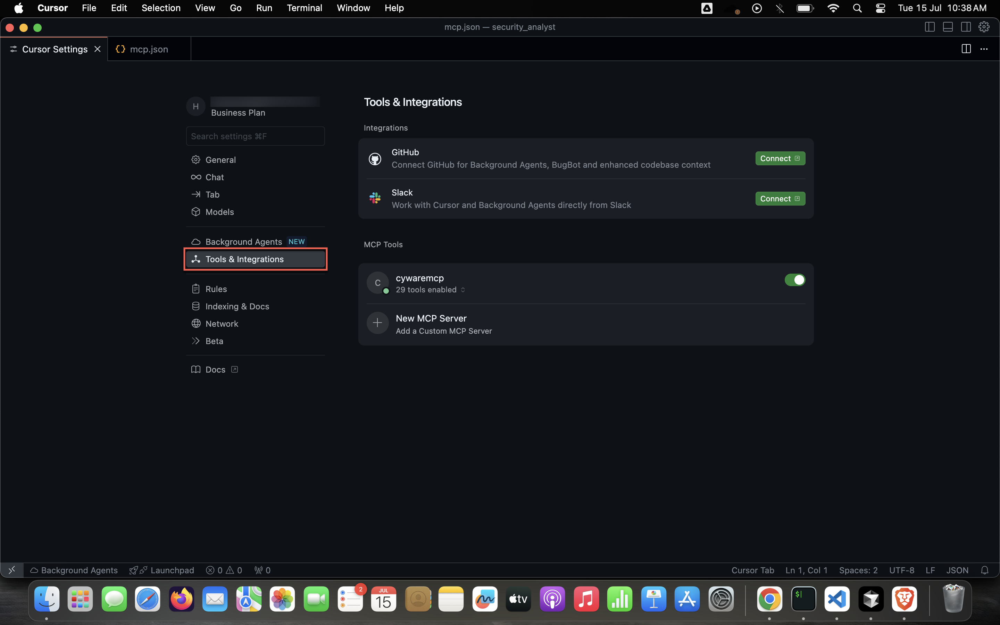
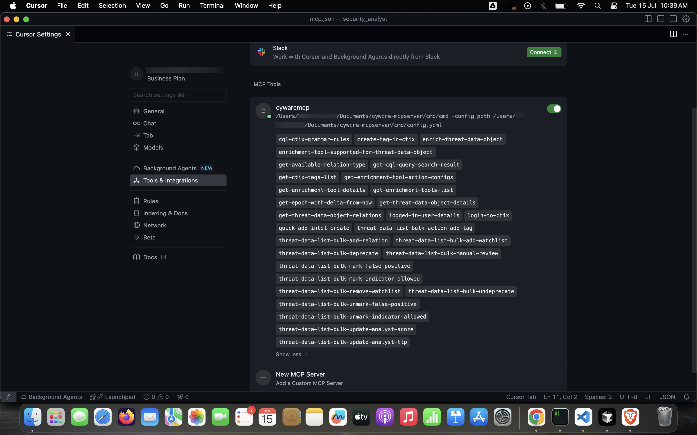
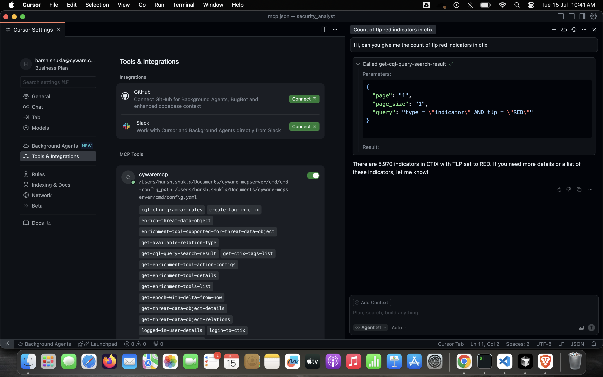

# Cyware MCP Setup Guide for Cursor

This guide will walk you through setting up Cyware MCP integration in Cursor IDE to enable enhanced AI capabilities with Cyware tools.

## Prerequisites

- Cursor IDE installed on your system
- Cyware MCP build available
- Administrator access to modify Cursor settings

## Setup Instructions

### Step 1: Access Cursor Settings

1. Open Cursor IDE
2. Navigate to the settings menu
3. Look for the settings interface as shown in 

### Step 2: Navigate to Tool Integrations

1. In the settings menu, locate the "Tool & Integrations" section
2. Click on the Tool Integrations option (reference: )
3. This will open the integrations configuration panel

### Step 3: Add Cyware MCP Configuration

1. In the Tool & Integrations section, you'll need to add the Cyware MCP configuration
2. Use the JSON configuration provided in 
3. Add the following configuration structure:

```json
{
     "mcpServers": {
       "Cyware MCP": {
         "command": "path/to/your/binary/cmd",
         "args": [
           "-config_path",
           "path/to/your/config.yaml"
         ]
       }
     }
   }
```

### Step 4: Verify Installation

1. After adding the configuration, save the settings
2. Restart Cursor IDE to apply the changes
3. Check the Tool & Integrations section to confirm Cyware MCP appears in the list
4. You should see the Cyware MCP integration active as shown in 

### Step 5: Test the Integration

1. Open the chat interface in Cursor
2. The chat interface should now have access to Cyware MCP tools
3. Test the integration by using a prompt that would utilize Cyware capabilities
4. Reference the example usage shown in 

## Usage

Once configured, you can use Cyware MCP in your Cursor chat interface by:

1. Opening the chat panel in Cursor
2. Typing prompts that require Cyware capabilities
3. The system will automatically use Cyware MCP tools when appropriate
4. You'll see responses enhanced with Cyware's threat intelligence and security insights

