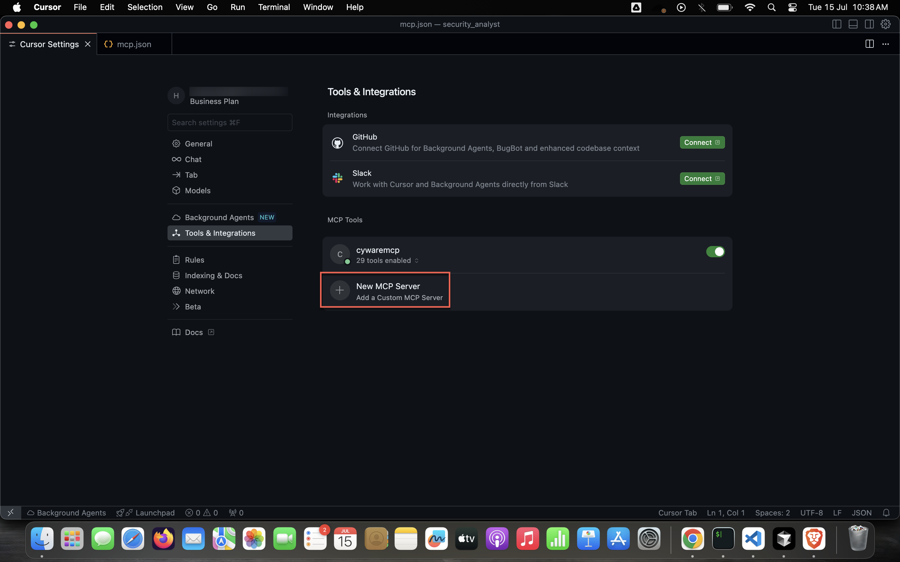

# Cyware MCP Setup Guide for Cursor

This guide will walk you through the set up of Cyware MCP Server integration in Cursor IDE to enable enhanced AI capabilities with Cyware tools.

## Prerequisites

- Cursor IDE installed on your system
- Cyware MCP build available
- Administrator access to modify Cursor settings

## Steps to configure

1. Open Cursor IDE and go to **Settings** > **Cursor Settings**.


2. In the left pane, click Tools & Integrations, then click New MCP Server.
<!--  -->


3. Once the mcp.json file opens, add the following content to configure the MCP server:

```json
{
     "mcpServers": {
       "cywaremcp": {
         "command": "path/to/your/binary/cmd",
         "args": [
           "-config_path",
           "path/to/your/config.yaml"
         ]
       }
     }
   }
```

4. After configuring, save the file and restart Cursor IDE to apply the changes.

5. Go to Tools & Integrations to confirm that the configured Cyware MCP Server appears in the list.

 

6. Open the chat interface in Cursor to verify the integration. Use a prompt that requires Cyware capabilities. For example, refer the below image:


