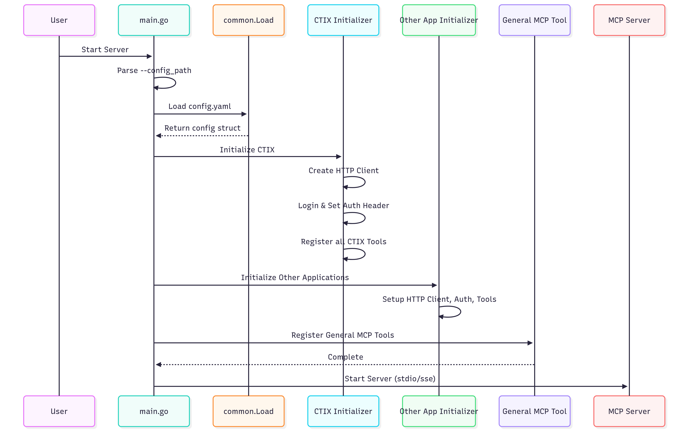

# Cyware MCP Server - High Level Design

This document describes the high-level architecture, design patterns, and initialization flow for the cyware-mcpserver project. The project is designed to support multiple applications, each with its own configuration, HTTP client, and toolset.

## Project Structure

```
cyware-mcpserver/
├── applications/
│   ├── ctix/
│   │   ├── helpers/              # Contains schemas and utility methods
│   │   ├── each_modules.go       # Implementation of all CTIX-specific MCP tools
│   │   └── initializer.go        # CTIX config, HTTP client, tools
│   │
│   └── <other-products>/         # Placeholder for other product integrations
│       ├── helpers/
│       ├── each_modules.go
│       └── initializer.go
│
├── cmd/
│   ├── main.go                   # Entry point: Initializes server and applications
│   └── config.yaml               # Global configuration (mode, product configs)
│
├── common/
│   ├── client.go                 # Reusable HTTP client logic
│   ├── config.go                 # YAML config loader and parser
│   └── responsfor exampleo               # Standardized API & tool response formats
```

## Key Design Concepts

### Per-Application HTTP Clients

Each application (for example, CTIX) has its own dedicated HTTP client. This is required because:
- Different base URLs
- Different authentication mechanisms (tokens, basic auth, and more.)
- Custom timeouts or headers

Clients are independently initialized to preserve modularity and separation of concerns.

### Initializer Pattern

Every application includes an `initializer.go` file responsible for:
- Loading app-specific configuration
- Initializing the app's HTTP client
- Performing authentication (for example, login)
- Registering relevant MCP tools
- Setting up any required internal dependencies

### Configuration Management

- The global `cmd/config.yaml` file is the single source of truth for all application and MCP settings
- The `common/config.go` file provides utility functions to:
  - Parse YAML config
  - Deserialize into structured Go types
  - Provide reusable access across the project

### Reusability & Modularity

- Shared logic for HTTP clients, configuration, and response formatting resides in the `common/` package
- This promotes DRY principles and makes it easy to add new applications with minimal duplication

## Code Flow

### 1. Entry Point
The application starts in `cmd/main.go`.

### 2. Parse CLI Arguments
Accepts `--config_path` CLI argument to specify the location of the configuration file.

### 3. Load Configuration
Uses `common.Load(configPath)` to load and deserialize `config.yaml`.

### 4. Initialize CTIX Application
- Creates a dedicated HTTP client using the base URL from CTIX config
- Authenticates via a login call
- Sets the Authorization header in the client for future use

### 5. Register CTIX MCP Tools

The following tools are registered for CTIX:

#### Auth & Session
- `LoginTool`
- `GetLoggedInUserDetailsTool`

#### CQL & Search
- `CQLCTIXSearchGrammarTool`
- `GetCQLQuerySearchResultTool`

#### Threat Data Object
- `GetThreatDataObjectDetailsTool`
- `GetThreatDataObjectRelationsTool`
- `GetAvailableRelationTypeListingTool`

#### Bulk Actions
- `ThreatDataListBulkActionTools`

#### Tag Management
- `CreateTagInCTIXTool`
- `GetCTIXTagListingTool`

#### Enrichment
- `GetEnrichmentToolsListTool`
- `GetEnrichmentToolDetailsTool`
- `GetEnrichmentToolActionConfigsTool`
- `GetAllEnrichmentToolsSupportedForThreatDataObjectTool`
- `EnrichThreatDataObjectTool`

#### Intel Creation
- `CreateQuickAddIntelTool`

### 6. Initialize Other Applications
Repeat similar steps (config loading, HTTP client init, tool registration) for other applications (for example, threat response, automation, and more).

### 7. Register General MCP Tools
Shared tools that apply across applications are registered here.

### 8. Start the MCP Server
- The server reads the mode (for example, sse, stdio) from config
- Starts the MCP server in the selected mode

## Sequence Diagram



## Summary

This design ensures:
- **Clean separation** of application-specific logic
- **Scalable architecture** for adding new applications
- **Config-driven, flexible** behavior
- **Minimal duplication** through centralized common utilities
- **Modular HTTP clients** for different authentication and API requirements
- **Standardized tool registration** and response formatting